# Administración de sistemas operativos

# Práctica 2.03 - NFS

### Integrantes del grupo: Daniel Gregorio González Mesa y Héctor Pedraza Aguilar

## 0. Introducción

El objetivo de esta práctica es utilizar el servicio NFS (Network File System). El NFS es un protocolo utilizado para sistemas de archivos distribuidos en un entorno de red de área local. Su objetivo es permitir que distintos sistemas conectados a una misma red local puedan acceder a ficheros remotos como si se trataran de recursos locales.

Para el desarrollo de la práctica utilizaremos 4 máquinas virtuales:

* Dos máquinas linux OpenSUSE. Una actuará como servidor de recursos NFS y la otra como cliente.
* Dos máquinas windows. Una máquina windows 2008 server que actuará como servidor y otra windows 7 que actuará como cliente. 

> **Nota**: la máquina windows 2008 server puede reemplazarse por un windows 7 enterprise. Las versiones professional e inferiores no permiten el servicio NFS.

## 1. NFS Windows

Para empezar con los preparativos he asignado los nombres a las máquinas como se pide en la práctica y la dirección IP.
Configuración de windows server 2008

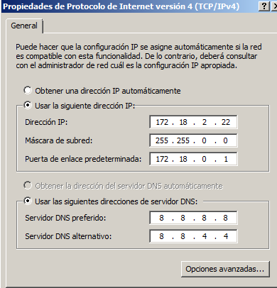
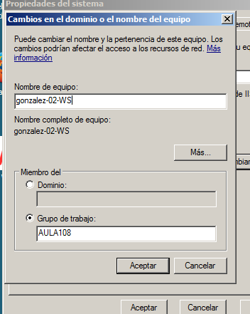

Configuración de windows 7

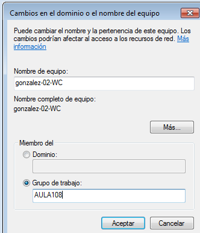
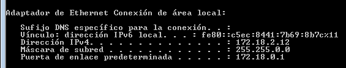

### 1.1 Servidor windows

En esta captura estoy instalando el servicio NFS en el windows 2008

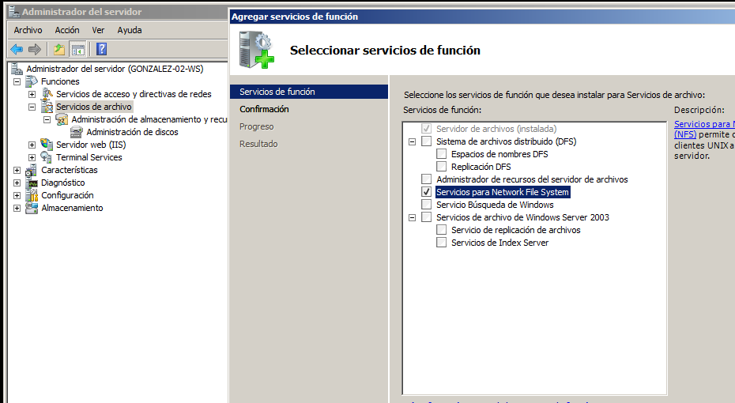

En esta captura estoy compartiendo por NFS las carpetas public y private y asignandoles los permisos.

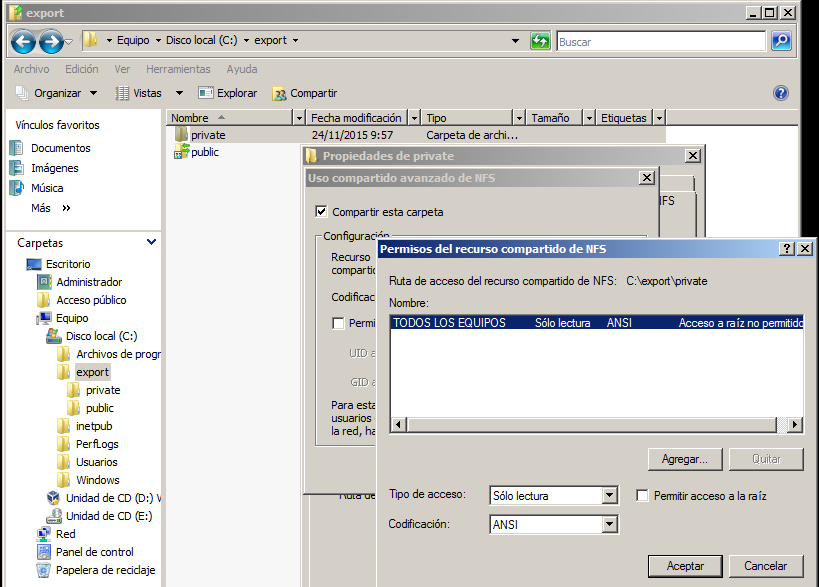
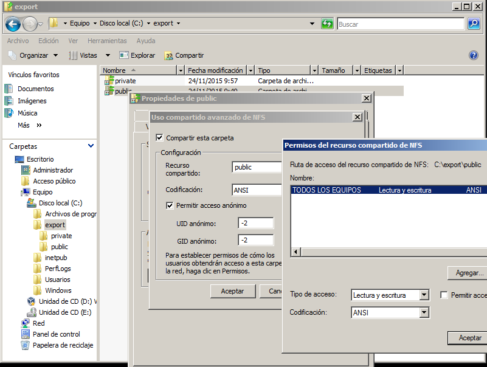

comando showmount -e 

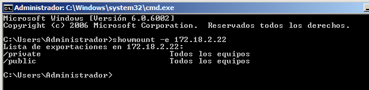

### 1.2 Cliente windows

En esta captura estoy instalando el servicio NFS en windows 7

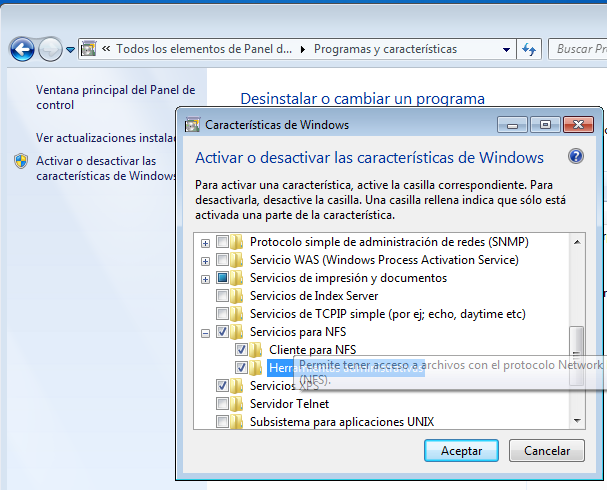

Servicio en ejecución

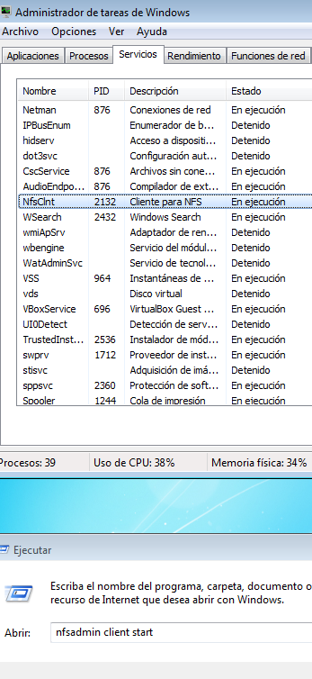

Montando las carpetas desde el cliente

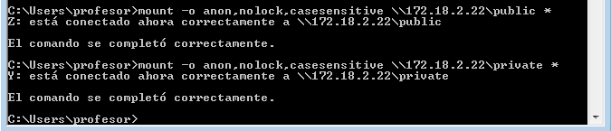

Carpetas montadas

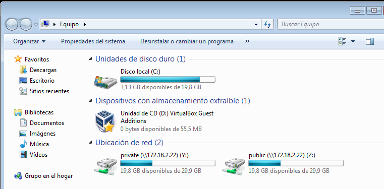

Carpetas montadas con public de opensuse

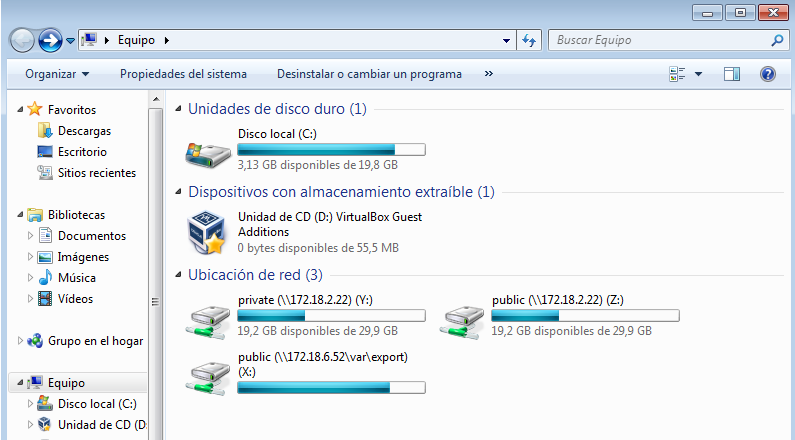

## 2. SO OpenSUSE

Ahora vamos a realizar el procedimiento en OpenSUSE.

Antes de empezar, tanto en la máquina servidor como cliente, establecemos la configuración de hosts y red correctamente.

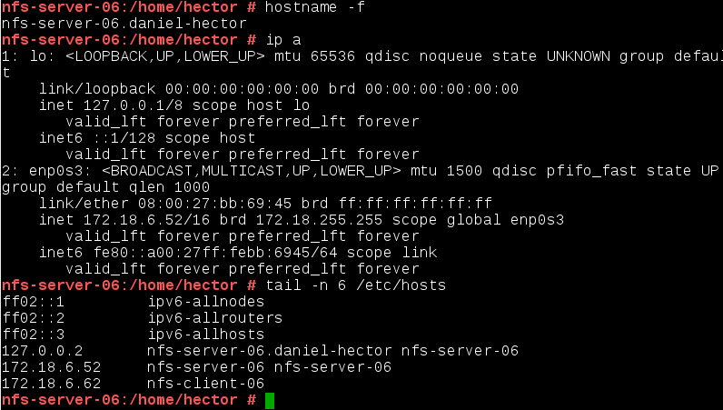

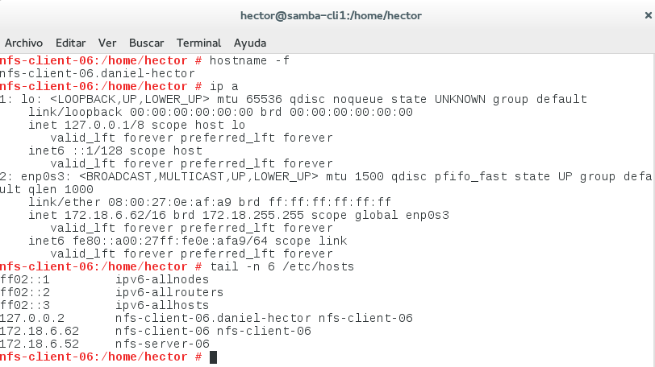

### 2.1 Servidor NFS en OpenSUSE

En función de la distribución que estemos utilizando, es posible que el servicio NFS venga instalado con el sistema. En nuestro caso no ha sido así, por lo que tendremos que instalarlo bien mediante yast o mediante línea de comandos.

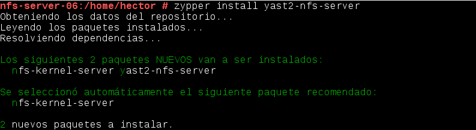

Una vez que esté instalado vamos a yast para configurarlo. Entramos y configuramos la primera pantalla como sigue. 

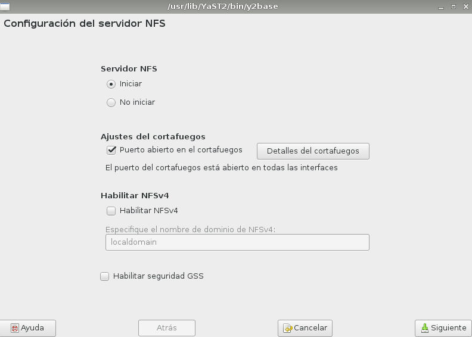

En la siguiente pantalla estableceremos los recursos que queremos compartir en la red, pero antes de esto tendremos que crear los directorios bajo los que se crearán los recursos compartidos. Los crearemos en `/var/export/`.

Creamos los directorios, eliminamos usuario y grupo propietario y otorgamos los permisos oportunos. 

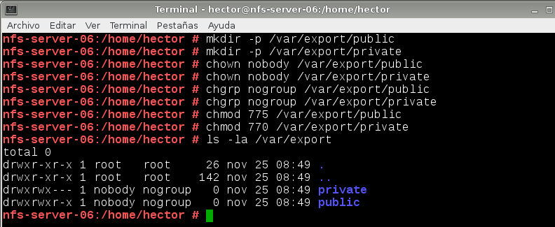

Ahora sí, vamos a crear los recursos NFS. Podemos hacerlo a través del yast como acabamos de ver o editando directamente el fichero `/etc/exports`. En nuestro caso usaremos este último método.

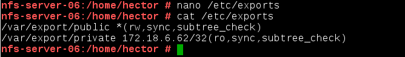

Ahora vamos a iniciar el servicio. Podemos hacerlo mediante la línea de comandos o mediante el yast. Aprovechamos también para habilitarlo para que se inicie con el arranque del sistema.

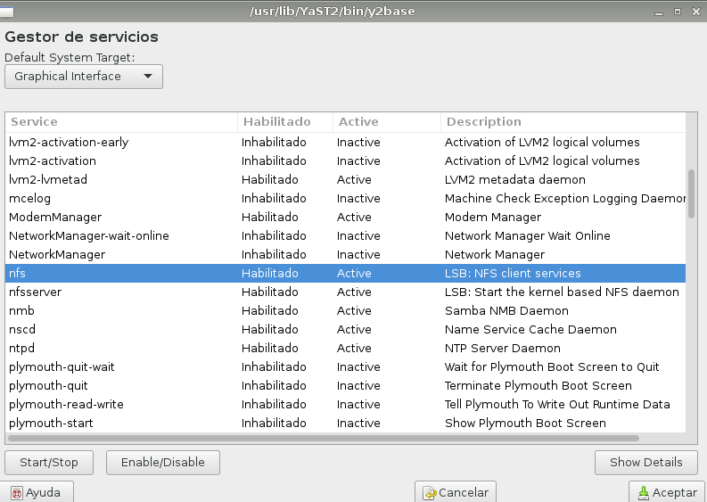

Cuando hayamos arrancado el servicio, podemos ejecutar el comando `showmount -e localhost` para comprobar los recursos que se están compartiendo ahora mismo en la máquina local. 

> Del mismo modo podemos ejecutar el comando con la ip del equipo en el cual queremos comprobar los recursos que está compartiendo.

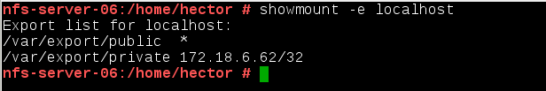

### 2.2 Cliente NFS

Ahora que ya tenemos los recursos compartidos en la red, pasamos a trabajar con el cliente.

Por defecto, OpenSUSE incorpora el cliente NFS. En caso de no ser así lo instalamos.

Ahora vamos a crear los directorios locales donde montaremos los recursos remotos. Crearemos la estructura bajo el directorio `/mnt/remoto/`. Montaremos tanto los recursos de la máquina servidor OpenSUSE como las de la máquina windows server 2008.

Tras crear los directorios, montamos los recursos mediante el comando `mount.nfs`.

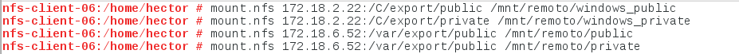

### 2.3 Montaje automático

Para terminar, vamos a configurar el fichero `/etc/fstab` para que los recursos remotos se monten automáticamente durante el inicio del sistema.

## 3. Preguntas

 ¿Nuestro cliente GNU/Linux NFS puede acceder al servidor Windows NFS? Comprobarlo.

No,monta las carpetas pero no puede acceder a ellas.

 ¿Nuestro cliente Windows NFS podría acceder al servidor GNU/Linux NFS? Comprobarlo.

si

